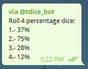

# Telegram bot hosted on heroku

This is a small bot used to simulated dice rolls using DnD's dice convention and Telegrams inline messages

### Example 

* #### Query: @tdice_bot 2d20
* Result: 
    * 

* #### Query @tdice_bot 4dp
* Result:
    * 
    
    
You can download it [here](https://storebot.me/bot/tdice_bot)
